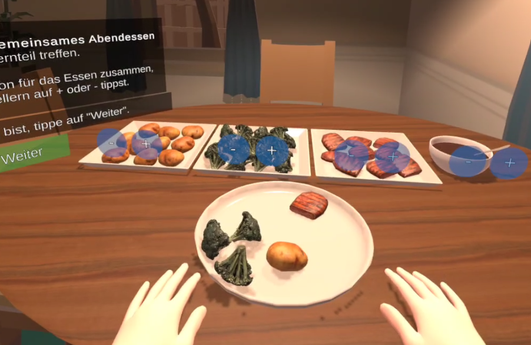

<h1 style="text-align: center;">Vera Golz</h1>

  Passionate about digital learning, (serious) games, and immersive 3D simulations, with a strong focus on user experience and a keen interest in designing inclusive experiences that prioritize accessibility.

---

# Education

20xx-2025  
**M.Sc. Applied Cognitive and Media Science**  
Specialisation: Computer Science (Graphic and Interactive Systems)  
_University of Duisburg-Essen_

2018-20xx  
**B.Sc. Applied Cognitive and Media Science**  
_University of Duisburg-Essen_

---

# My Projects

## [Master's Thesis: Multiplayer VR Simulation targeting Adolescents with Anorexia Nervosa](Projects/masters_thesis.md)

  

    In my master's thesis, I conceptualized and developed a VR simulation, supporting the perspective-taking between adolescents with Anorexia Nervosa and their parents for better therapy outcomes. This work contained a thorough requirements analysis, including extensive literature research and iterative interviews with clinicians, the development in C# for Unity for the Meta Quest 3 and a final evaluation.
  

---

## Research Project (KoKri)

---

## [3D-Modeling of the Old Synagogue of Gelsenkirchen](Projects/synagogue.md)

Implemented in the course of my work at _mxr storytelling_, this project aims to preserve the culture of memory of the jewish community in Gelsenkirchen, Germany, by virtually reconstructing the old synagogue which was destroyed during the November pogroms in 1938. Due to the lack of old photographs, the modeling oriented on existing cross-section drawings and house files, conversations with members of the Christian Jewish community, historicans, and architects, and extensive research of the building materials.

---

## Robotic Arm

...not yet started.
